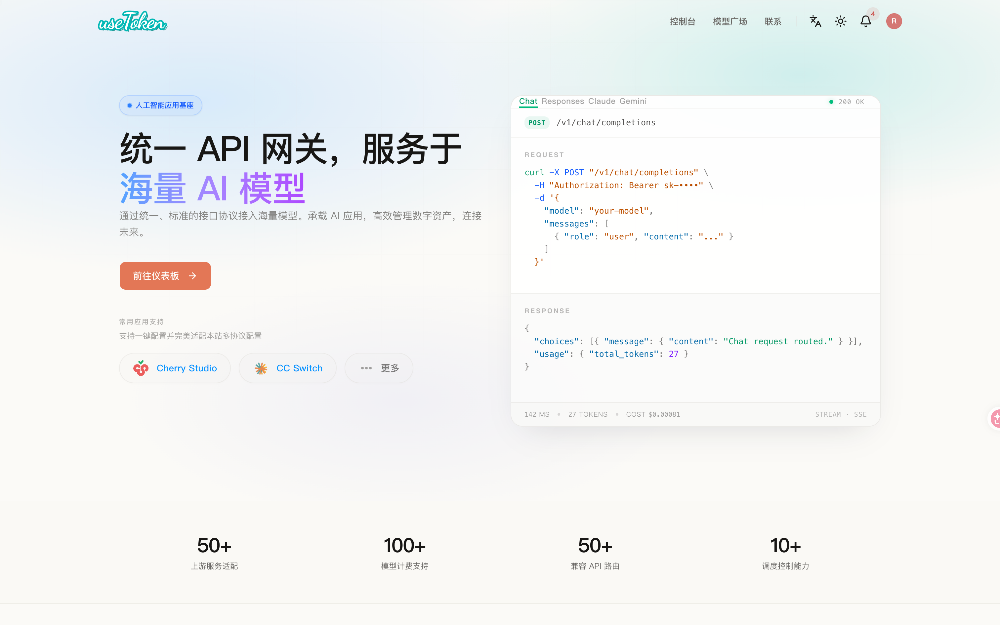
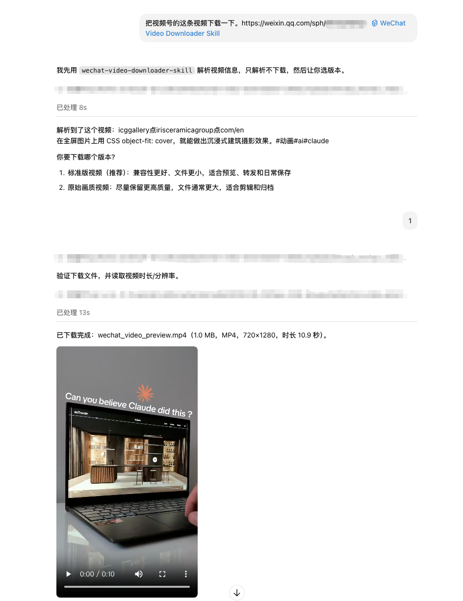

# WeChat Video Downloader Skill

> 一条微信视频号分享链接，一句提示词，保存成本地 MP4。

## 安装

```bash
npx skills add eric-shuwei/wechat-video-downloader-skill
```

Codex、Claude Code、Cursor 等支持 Skills 的 Agent 均可安装使用。

## 赞助商



[useToken](https://token.offerya.cc)｜AI大模型中转站 赞助本项目，提供高性价比、稳定易接入的 Codex 等 Agent API 中转服务，支持 GPT-5.5、GPT-5.4、Claude Opus 4.8、Claude Opus 4.7 等模型能力，适合中小企业、程序员及日常工作使用。

UseToken 为本 Skill 用户提供特别优惠：在该网站注册，并在充值时填写优惠码 `eric-shuwei`，首次充值可享受 9 折优惠。

## 能做什么

在 Agent 里发送一个微信视频号分享链接，Skill 会先解析视频信息，让你选择下载版本，然后保存为本地 MP4 文件。

- 支持微信视频号分享链接
- 下载前先解析视频信息，避免下错内容
- 支持 **标准版视频** 和 **原始画质视频** 两种版本
- 自动保存为本地 MP4 文件
- 自动生成安全文件名
- 不需要额外安装 Python 第三方包

## 使用方式

安装后，在 Agent 里直接说：

```text
帮我下载这个微信视频号视频：https://weixin.qq.com/sph/...
```

Agent 会先让你选择版本：

```text
1. 标准版视频（推荐）
2. 原始画质视频
```

选择后，Agent 会下载视频并返回本地 MP4 文件路径。



## 常见问题

### 链接解析失败怎么办？

重新复制一个最新的视频号分享链接后再试。部分分享链接可能会过期，或者内容已经不可访问。

### 应该选“标准版视频”还是“原始画质视频”？

如果只是保存、预览、转发，优先选 **标准版视频**。

如果要剪辑、归档，或者希望尽量保留更高质量，优先选 **原始画质视频**。

### 下载的视频保存在哪里？

默认由 Agent 保存到当前工作目录下的 `outputs/` 文件夹，并返回本地 MP4 文件路径。

## 开源协议

本项目使用 MIT License，详见 [LICENSE](LICENSE)。

## 作者

书伟是花生是 AI Native Coder、独立开发者、AI 自媒体博主。

提供企业 AI 落地服务，包括 Skill、Agent 定制。

合作咨询微信：`shuweibest`，请备注事由。
